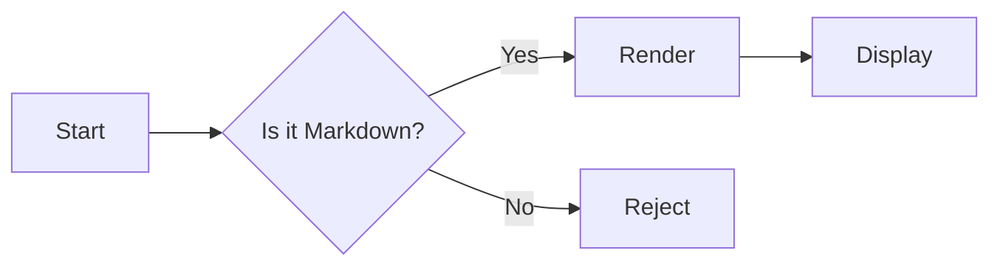
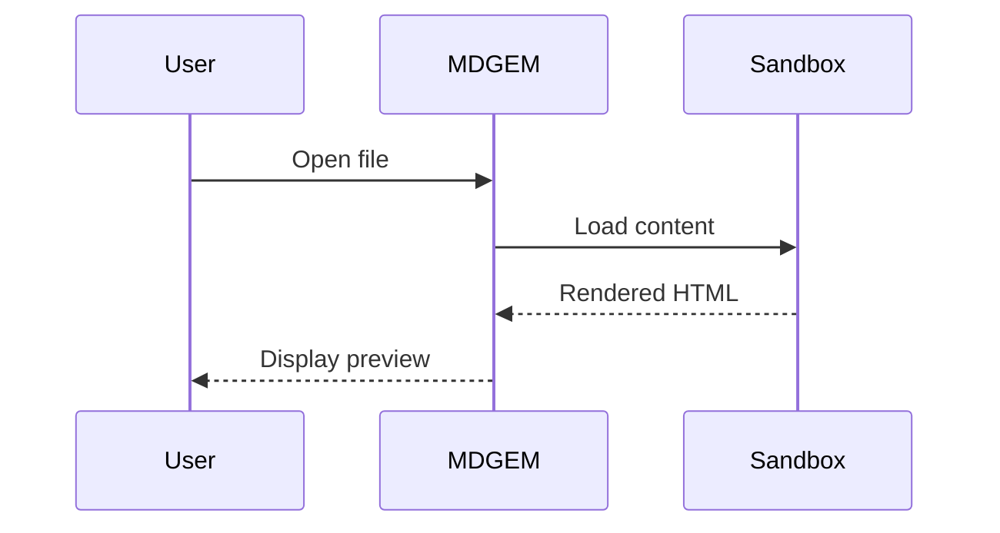

<!-- TOC: 使用 HTML 注释，部分渲染器支持自动生成 -->
# MDGEM Test Sample — 全特性回归测试

> 本文件覆盖渲染器所有特性，用于一键回归扫描。每个区块标注了测试目标。
> 最后更新：2025-06-20

---

## 1. 标题层级 (Headings)

<!-- test: heading levels 1–6 -->
# H1 — 一级标题
## H2 — 二级标题
### H3 — 三级标题
#### H4 — 四级标题
##### H5 — 五级标题
###### H6 — 六级标题

---

## 2. 行内格式 (Inline Marks)

<!-- test: bold, italic, strike, code, link, image, combined -->
| 语法 | 渲染 |
|------|------|
| `**粗体**` | **粗体文本** |
| `*斜体*` | *斜体文本* |
| `~~删除~~` | ~~删除线文本~~ |
| `` `行内代码` `` | `inline code` |
| `[链接](url)` | [GitHub](https://github.com) |
| `` |  |

### 嵌套格式 (Nested Inline)

<!-- test: overlapping / adjacent inline tokens -->
- **粗体中带 *斜体* 再回来** — bold+italic nest
- **粗体 + `代码` + 粗体** — bold+code adjacent
- ~~删除 + **粗体** + ~~ — strikethrough+bold
- *斜体 ~~删除~~ 斜体* — italic+strikethrough nest

---

## 3. 链接与自动链接 (Links & Autolinks)

<!-- test: inline link, reference link, autolink, email -->
- 行内链接：[MDGEM 项目](https://github.com)
- 引用式链接：[点击这里][ref1]
- 自动链接（裸 URL）：https://www.example.com
- 邮件自动链接：test@example.com
- 带标题的链接：[带 title](https://github.com "GitHub 首页")

[ref1]: https://github.com "引用式链接目标"

---

## 4. 列表 (Lists)

### 无序列表 (Unordered)

<!-- test: multi-level unordered -->
- 一级项目 A
  - 二级项目 A-1
    - 三级项目 A-1-a
  - 二级项目 A-2
- 一级项目 B
  - 二级项目 B-1
- 一级项目 C

#### 混用标记符

<!-- test: mixed markers (*, -, +) -->
* 星号标记
- 短横标记
+ 加号标记

### 有序列表 (Ordered)

<!-- test: ordered with various start numbers -->
1. 第一步
2. 第二步
   1. 子步骤 2.1
   2. 子步骤 2.2
3. 第三步

#### 非 1 起始的有序列表

<!-- test: ordered list starting at ≠1 -->
3. 从 3 开始
4. 第四项
5. 第五项

### 任务列表 (Task List — GFM)

<!-- test: task list, checked/unchecked, nested -->
- [x] 已完成任务
- [x] 已完成带嵌套
  - [x] 子任务已完成
  - [ ] 子任务未完成
- [ ] 未完成任务
- [ ] 另一个待办

---

## 5. 引用块 (Blockquotes)

<!-- test: single, multi-line, nested -->
> 单行引用块

> 多行引用块：
> 第一行。
> 第二行。
>
> 空行后的第三行。

> 外层引用
>> 内层嵌套引用
>>> 第三层嵌套引用
>>
>> 回到第二层
>
> 回到第一层

---

## 6. 代码块 (Code Blocks)

### 围栏代码块 (Fenced)

<!-- test: fenced code with language, indented code -->
```python
def fib(n: int) -> int:
    """Return the n-th Fibonacci number."""
    if n < 2:
        return n
    return fib(n - 1) + fib(n - 2)


print([fib(i) for i in range(10)])
# Output: [0, 1, 1, 2, 3, 5, 8, 13, 21, 34]
```

```swift
import SwiftUI

@main
struct Hello: App {
    var body: some Scene {
        WindowGroup { Text("Hi MDGEM 👋") }
    }
}
```

```typescript
// TypeScript — 类型注解测试
interface PreviewConfig {
  name: string;
  features: Feature[];
  nested: { enabled: boolean; count: number };
}

const cfg: PreviewConfig = {
  name: "mdgem",
  features: ["markdown", "image", "video"],
  nested: { enabled: true, count: 42 },
};
```

```json
{
  "name": "mdgem-preview-demo",
  "version": "1.0.0",
  "features": ["markdown", "image", "video", "html", "code"],
  "nested": { "enabled": true, "count": 42, "ratio": 0.618 }
}
```

### 无语言标注的代码块

<!-- test: code block without language -->
```
No language specified — should render as plain text / monospace.
```

### 缩进代码块 (Indented — 4 spaces)

<!-- test: indented code block -->

    // Indented code block (4 spaces)
    printf("Hello, World!\n");
    return 0;

---

## 7. 数学公式 (KaTeX / MathJax)

<!-- test: inline & display math -->

### 行内公式

质能方程：$E = mc^2$；勾股定理：$a^2 + b^2 = c^2$；黄金比例：$\phi = \frac{1+\sqrt{5}}{2} \approx 1.618$。

### 块级公式

$$
\int_{0}^{1} x^2 \, dx = \frac{1}{3}
$$

$$
f(x) = \sum_{n=0}^{\infty} \frac{f^{(n)}(a)}{n!} (x - a)^n
$$

$$
\begin{bmatrix}
1 & 2 & 3 \\
4 & 5 & 6 \\
7 & 8 & 9
\end{bmatrix}
$$

---

## 8. 图表 (Mermaid)

<!-- test: flowchart, sequence, state — each in its own fenced block -->

### 流程图 (Flowchart)



### 序列图 (Sequence)



---

## 9. 表格 (Tables — GFM)

<!-- test: alignment, inline formatting in cells, empty cells, long content -->

### 基本表格

| 特性 | 状态 | 备注 |
| :--- | :--: | ---: |
| Code highlight | ✅ | highlight.js |
| Mermaid | ✅ | Lazy-loaded |
| KaTeX | ✅ | Inline + display |
| Tables | ✅ | GFM |

### 对齐测试

| 左对齐 | 居中 | 右对齐 |
| :----- | :--: | -----: |
| left | center | right |
| L | C | R |

### 单元格内格式

<!-- test: bold/code/link inside table cells -->
| 文件 | 类型 | 操作 |
|------|------|------|
| `demo.html` | HTML | [查看](./demo.html) |
| `sample.py` | Python | **主要** |
| `config.json` | JSON | *可选* |

---

## 10. 水平线 (Horizontal Rules)

<!-- test: various HR syntaxes -->

三段式：
---

星号式：
***

下划线式：
___

---

## 11. HTML 内嵌 (Raw HTML)

<!-- test: inline and block HTML mixed with Markdown -->

### 行内 HTML

使用 <kbd>Ctrl</kbd> + <kbd>S</kbd> 保存，或者 <mark>高亮</mark> 这段文字。

上标<sup>TM</sup> 和下标 H<sub>2</sub>O 测试。

### 块级 HTML

<div style="padding:12px 16px; border:2px dashed #0969da; border-radius:8px; margin:10px 0;">
  <strong>🟦 这是一个 HTML div 块</strong>，内部可以包含 <em>任意 HTML</em>。
</div>

<details>
  <summary>点击展开折叠区域</summary>

  折叠内容 — 这里可以是 Markdown，但 `<details>` 内的 Markdown 支持因渲染器而异。
</details>

---

## 12. 脚注 (Footnotes)

<!-- test: footnote rendering -->

这是一个带脚注的句子[^1]，后面还有一个脚注[^note]。

[^1]: 第一个脚注的详细说明，可以包含**格式**。
[^note]: 第二个脚注，名称可以自定义。

---

## 13. 定义列表 (Definition Lists)

<!-- test: definition list (some renderers support this) -->

术语一
: 这是术语一的定义。定义可以很长，也可以包含行内格式。

术语二
: 这是术语二的第一个定义。
: 这是术语二的第二个定义（多定义）。

---

## 14. Emoji & 特殊字符

<!-- test: Unicode emoji, GFM emoji shortcodes -->

- Unicode：🎉 ✅ ❌ ⚠️ 💡 🚀 🔥
- Shortcodes（GFM）：:tada: :rocket: :warning: :sparkles:
- 特殊字符：&copy; &trade; &reg; &mdash; &ndash;

---

## 15. 转义与边界 (Escaping & Edge Cases)

<!-- test: escaped chars, backticks, entity -->

### 转义字符

\*不是斜体\* · \`不是代码\` · \# 不是标题 · \[不是链接\]

### 反引号中的反引号

`` `单反引号内的代码` `` — 使用双反引号包裹。

```markdown
在代码块中展示 Markdown 语法：
`code` **bold** *italic*
```

### HTML 实体

&alpha; = &beta; + &gamma; · 1 &lt; 2 &amp; 3 &gt; 2

---

## 16. 空白与段落 (Whitespace & Paragraphs)

<!-- test: paragraph breaks, trailing spaces (hard break), soft break -->

段落一：这是一个段落，后面紧跟两个空格后换行（hard break）。  
这是同一段落的新行。

段落二：这是一个段落，后面没有尾随空格直接换行（soft break）。
这应该还是同一个段落，除非渲染器开启了 GFM 换行。

段落三：上面有两个空行，应形成独立段落。

---

> ✅ 全特性回归测试结束。如果渲染器正确，上述所有内容应当正常显示。
