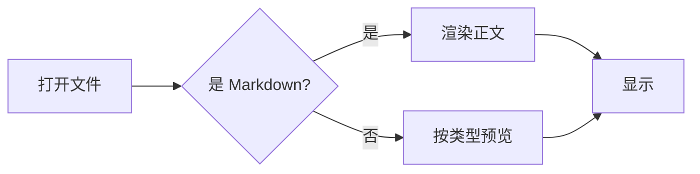

# MDGEM 示例文档

这是 **MDGEM** 的主示例文档,用来快速验证渲染管线是否正常。
`make open-sample` 打开的就是这个文件。

---

## 文本样式

普通段落,支持 **粗体**、*斜体*、~~删除线~~、`行内代码`,以及
[链接](https://github.com)。还有上标 H~2~O 与下标 x^2^(若启用)。

> 引用块:一段被引用的文字。
>
> > 嵌套引用也可以。

## 列表

- 无序项一
- 无序项二
  - 嵌套项
  - 嵌套项
- 无序项三

1. 有序项一
2. 有序项二
3. 有序项三

任务清单:

- [x] 已完成的任务
- [ ] 未完成的任务
- [ ] 另一个待办

## 表格

| 格式 | 是否支持 | 说明 |
|------|:------:|------|
| Markdown | ✅ | markdown-it |
| 代码高亮 | ✅ | highlight.js |
| 数学公式 | ✅ | KaTeX |
| 流程图 | ✅ | Mermaid |

## 代码块

```js
// JavaScript 示例
function greet(name) {
  return `Hello, ${name}!`;
}
console.log(greet("MDGEM"));
```

```python
# Python 示例
def fib(n):
    a, b = 0, 1
    for _ in range(n):
        a, b = b, a + b
    return a
```

## 数学公式

行内公式 $E = mc^2$,以及独立公式:

$$
\int_{-\infty}^{\infty} e^{-x^2}\,dx = \sqrt{\pi}
$$

## 流程图(Mermaid)



## 图片


---

> 提示:左侧文件树里还有一个 `templates/` 目录,放了各类受支持格式的模板文件,点开即可预览。
